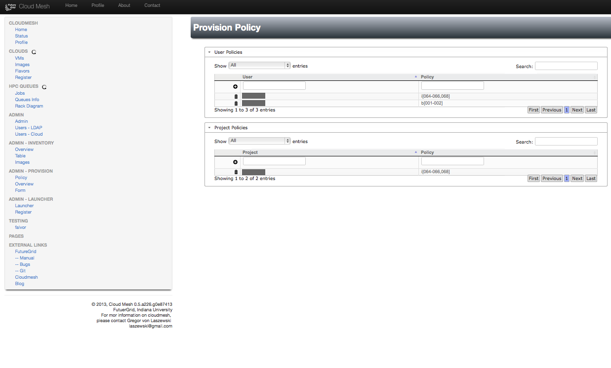

Screenshots
==========================================

Please note that cloudmesh supports a role based user policy
model. Although you may see some screenshots of advanced features some
of these features may not yet released to the users.

Cloud Management
----------------------

Cloudmesh has a simple interface to register and conduct some
elementary management functions.  In contrast to other systems
cloudmesh uses the native cloud protocol and is not just relying on
the EC2 compatible clouds. Certainly the Graphical user interface can
be improved and customized.  We have just provided a very simple
interface that focuses on exposing more info that encourages you to
conduct more with the management functionality instead of just hiding
information to the user.  For end-users, we can naturally develop a
much simpler interface, as for example is demonstrated in our launcher
(which is not yet released).

.. figure:: images/img/cm_images/cloud_register_ec2.png
   :width: 80%
   :align: center

   **Figure:** Registering an EC2 compatible cloud

.. figure:: images/img/cm_images/cloud_register_openstack.png
   :width: 80%
   :align: center   
   
   **Figure:** Registering an OpenStack protocol compatible cloud. 

.. figure:: images/img/cm_images/manage_vms.png
   :width: 80%
   :align: center   
   
   **Figure:**  Starting and deletion of VMs is easy in cloudmesh through a simple table view.

Provisioning/Raining (Not yet released)
------------------------------------------

Cloudmesh contains the ability to provision a server via bare metal
access by the users.  To simplify this already available access we are
currently developing a simpler interface to it. We have already
implemented a policy based access control that allows a role based
access based on projects and users. In near future we will integrate
our bare metal provisioning management.  features into this system.

.. figure:: images/img/cm_images/launcher.png
   :width: 80%
   :align: center
      
   **Figure:** Launching predefined configurations on FutureGrid

      
   **Figure:** Defining the baremetal access policy

Batch Queues
------------------------

Hadoop is often installed on a cluster. Thus having access to the
queues to monitor queue based resource reservation for Hadoop jobs (or
and other HPC job) is conveniently provided in cloudmesh. Launchers
(under development) can be used to easily interface with the systems
and conduct customized job creation. Via MyHadoop for example it is
possible to start Hadoop jobs in queues on FutureGrid.

.. figure:: images/img/cm_images/qinfo.png
   :width: 80%
   :align: center
      
   **Figure:** Listing the available queues

.. figure:: images/img/cm_images/qstat.png
   :width: 80%
   :align: center
      
   **Figure:** Listing the queue information about jobs and status

Status
-----------------

The status of the system will be visible in a status window. Here we
just show a view of the HPC resources. We already have developed a
cloud monitoring system that we intend to integrate soon. For
FutureGrid this system is already deployed via the FG portal.

.. figure:: images/img/cm_images/status_hpc.png
   :width: 80%
   :align: center   
   
   **Figure:** Displaying a simple status of the systems (here HPC).

Inventory
---------------

Often we just need to know sme details about the system. To facilitate
this, we have developed an inventory. In addition we also developed
physical view of the rack that can either be augmented with service
type displays or temperature of the rack.

.. figure:: images/img/cm_images/inventory.png
   :width: 80%
   :align: center   

   **Figure:** Inventory of the systems. 

.. figure:: images/img/cm_images/service_map.png
   :width: 80%
   :align: center
      
   **Figure:** Service map to depict which server is dedicated to which services
   
.. figure:: images/img/cm_images/temperature_map.png
   :width: 80%
   :align: center
      
   **Figure:** Temperature map of a rack
   

   
   
