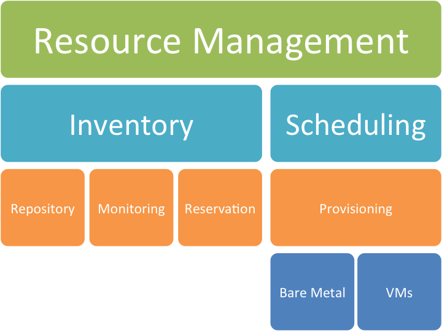

Design: Blueprint
======================================================================

Features
----------------------------------------------------------------------

The features we envision include

* An inventory system to add our servers and services
* The ability to provision an OS on the servers
* The ability to provision services onto the servers
* The ability to move services between servers

Design requiremnts include

* The support of services such as

  * SLURM worker nodes
  * OpenStack  worker nodes
  * Eucalyptus worker nodes

Difference to other efforts
----------------------------------------------------------------------

This system is different form other efforts as it allows to run HPC,
Eucalyptus and OpenStack services on the same cluster.

Component View
----------------------------------------------------------------------

Our design includes four different commonent portions:

* Interfaces

  * Portal
  * Command Line
  * API
  * REST

* User Management

  * Authentication
  * Authorization
  * LDAP
  * OpenStack Integration
  * Eucalyptus Integration
  * HPC Integration
  * Accounting 

* Image Management

  * RAIN templated imapge management
  * IaaS image management
  * HPC imabe management

* Resource Management

  * Scheduling 
  * Reservation
  * OS provisioning
  * Service provisioning

Our design focusses on satisfying our various user communities by
providing four main categories of interfaces. This includes

.. figure:: images/Slide02.png
   :align: center

   **Figure:** The component view of the design

.. figure:: images/Slide03.png
   :align: center

   **Figure:** The subcomponents of the design

Component User Management
----------------------------------------------------------------------

.. figure:: images/Slide05.png
   :align: center
   :scale: 50%

   **Figure:** The subcomponent user management

User Management
----------------------------------------------------------------------

We reused scripts from before that were not properly done, but carried
us over. Limits of these scripts have been reached in regards to

* Group management
* Deactivation of accounts
* Integration to accounting system
* Changing IaaS faremworks (mostly done)
* Better use of backup services

* Plan fg-manage

  * fg-manage opentack 

    * Update the yaml file generation
    * Update deployment of yaml file
    * Deploy on machines 

  * fg-manage eucalyptus 

    * Update the yaml file generation
    * Update deployment of yaml file
    * Deploy on machines 

  * Documentation

  * Time needed: less than a week

* Plan fg-manage xsede

  * Develop small convenience scripts to monitor incomming users from xsede
  * Develop document so that account creation can be done with multiple persons and not just Allan

Can be done as part of ongoing work, less than a day

* Authorization: Active and Deactive users

  * Current LDAP has only authorized users in it. 
  * With joining of XSEDE we need also to deactivate users by not just removing them from LDAP.
  * Idea. Create master LDAP tree, from which we copy into active and deactive user trees.
     * This was actually suggested by Archit way back, but was rejected at that time.

Accounting (Will not be worked on much)
----------------------------------------------------------------------

* New development of accounting 
    * Cloud Metric (hyungro):
    * Switch database from sql to mongodb (1 week)
    * Develop commandline tools to backup, and manipulate data (1 week). 
    * Variable charge model (1 week)
    * Integration with gold via cm_accounting (1 week)
* Cm_accounting:
     * Functionality interface to gold(1 week, started by Gregor, disbandening 1-1-gold interface from Hyungro as not needed and unimportant for our work)
* XSEDE tests and updates
      * Interact with xsede (one phone call every week)

Component Resource Management (includes cloudshifting as part of reservation)
-------------------------------------------------------------------------------

Resource Management
----------------------------------------------------------------------

* Inventory
    * Requirements
        * Have inventory of all hardware compute resources
        * Have a mechanism to describe networks between resources
        * Provide status information
        * Use information for scheduler and reservation
        * Use inventory for cloud shifting
        * Totally independent from XCAT, SLURM, OpenStack, Eucalyptus or other systems, but can be used by such
        * Inventory is needed to determine what SHOULD run on them not just what currently runs on them
        * IMPORTANT: Includes inventory of services it is not just a compute fabric inventory
* Development
        * All in python, mongodb
        * Has backup with timestamps
        * We will just start with compute servers and for us important services that run on such servers
        * Servers will have rest interface so we can also query what runs on them
        * Estimated time 3 weeks overall
        * Networking is abit fuzzy as we need real inventory of existing networks first before we can determine wht we should do to simplify access to it

Scheduler
----------------------------------------------------------------------

* Approach via Torque/Maui
   * Advantage
       *  use existing HPC scheduler to allow bare metal just as any regular hpc job
       *  Originally suggested in 2010 and 11 
   * Disadvantage
       *  Not all services we have are or should be integrated in HPC scheduling service
       *  Approach hierarchical scheduler
   * Decouple scheduling decision form Moab/Maui
   * Provide integration with various monitoring tools so we can identify IMPORTANT status for shifting resources to services
   * Provide simple reservation interface
   * Have first a human scheduler using simple cloudmesh commands
   * Provide abstraction to bare metal provisioning so we are independent from openstack bare metal, moab, slurm, cobler bare metal provisioning. Provide only absolute necessary
       *  Biggest issue is that we have ongoing production and that both ways require essentially a *vanilla* cluster
       *  Networking 

   **Figure:** The Subcompoenet for resource management

Interfaces
----------------------------------------------------------------------

* Portal
* Freeze development as much as possible
* Focus on metric integration, status update, project page improvements
* Shift focus on content
* URL management needs to be improved
* Not all features of the portal have been properly communicated to users or and the portal framework has not been properly integrated into our processes leading to a confusion on users and staff side.
   * A) Example automatic forum posts to blogs
   * B) Some in our own team do not use the portal and we miss clear opportunities of improvements
   * C) Redesign of project information shows that information in projects has been removed that is essential but this removal leads now to confusion in project application process. 
* There are more.
* Fix: Fugang, Allan, Gregor, will join Carrie and Barbara for 5-7 business days to get most technical issues resolved, so we can focus on content after that.
   * Remaining tasks will be identified.
      * I expect small fixes need to be done.
      * Some new aspects of the portal are to be improved
      * Some god things from the xsede portal was not implemented in our portal over the last year
* Command line & API
   * Use uniformly CMD3 (developed by Gregor)
      * Will provide clean command line tool
      * Automatically delivers a shell
   * REST services via flask (cloudmesh)
   * Integration with OpenID via CRWOD (demonstrated by Gregor)
   * Focus on cloudmesh abstraction and inventory to manage multiple clouds, rain, and resources for shifting/reprovisioning. 
   * Will be ongoing principal

